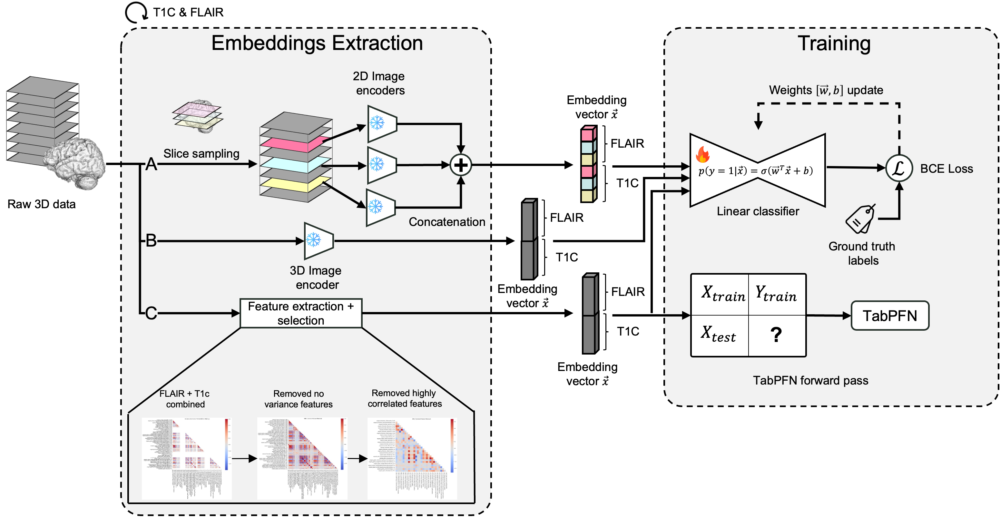

# A Benchmark of (MRI-) Foundation Models to Predict IDH Mutational Status in Glioma

Code accompanying the paper. We benchmark four image foundation models (BrainIAC, MRI-CORE, BiomedCLIP, BrainDINO) against two radiomics baselines (regularized logistic regression and TabPFN) for IDH mutation prediction across five adult-glioma MRI cohorts (UCSF-PDGM, UPENN-GBM, EGD, UTSW-Glioma, and the external UCSD-PTGBM).




## What Is Included

```
.
├── configs/configs.yaml         OmegaConf paths and training defaults
├── data/
│   ├── README.md                Where to obtain each cohort's raw imaging
│   └── csvs/                    Per-cohort IDH labels, train/val/test splits,
│                                merged PyRadiomics features (provided so users
│                                only need to download raw NIfTIs)
├── src/
│   ├── preprocessing/           Skull-strip, normalize, PyRadiomics extraction
│   ├── embeddings/              Per-foundation-model embedding extraction
│   ├── datasets/                Per-cohort BrainIAC loaders + embedding cache
│   ├── models/linear_probe.py   The single trainable component (image side)
│   ├── training/                train_lin_probe, train_log_reg, train_tabpfn
│   └── utils/                   Paths, splits, metrics, external-test runner
├── run_all.sh                   Orchestrates the full pipeline end to end
├── environment.yml              Conda environment
```

**Not included** (download / regenerate separately): raw imaging volumes, pretrained foundation-model checkpoints, extracted embeddings, paper figures and tables.

## Installation

Requires Python 3.12 and a CUDA-capable GPU.

```bash
git clone <repo-url> idh-mutation-prediction-release
cd idh-mutation-prediction-release
conda env create -f environment.yml
conda activate idh_pred_clean
```

The foundation-model encoders require their original source repositories on `sys.path` and downloaded weights. Clone:

```bash
git clone https://github.com/AIM-KannLab/BrainIAC          reference/BrainIAC
git clone https://github.com/mazurowski-lab/mri_foundation reference/mri_foundation
git clone https://github.com/mclwu22/BrainDINO             reference/BrainDINO
```

Place checkpoints under `checkpoints/pretrained/<model>/`:

| Model      | Source                                                                                                | Filename               |
|------------|-------------------------------------------------------------------------------------------------------|------------------------|
| BrainIAC   | https://github.com/AIM-KannLab/BrainIAC (release assets)                                              | `BrainIAC.ckpt`        |
| MRI-CORE   | https://drive.google.com/file/d/1nPkTI3H0vsujlzwY8jxjKwAbOCTJv4yW/view                                | `mri_foundation.pth`   |
| BiomedCLIP | https://huggingface.co/microsoft/BiomedCLIP-PubMedBERT_256-vit_base_patch16_224                       | loaded by `open_clip`  |
| BrainDINO  | request from the authors (ywu3024@gatech.edu)                                                         | `model.pth`            |

TabPFN runs through the hosted `tabpfn_client`, export your token before the radiomics pipeline:

```bash
export TABPFN_TOKEN="<your-token>"
```

## Quickstart

Download raw imaging into `data/<cohort>/` following the per-cohort layouts in [`data/README.md`](data/README.md), then:

```bash
# 1. one-time skull-strip / z-score / canonical-name population
python -m src.preprocessing.rfe_preprocessing --dataset UCSF-PDGM
# ...repeat for UPENN-GBM, ERASMUS-GBM, UTSW-Glioma, UCSD-PTGBM

# 2. embeddings for one (model, cohort, sequence)
python -m src.embeddings.get_emb_braindino --dataset UCSF-PDGM --sequence FLAIR
python -m src.embeddings.get_emb_braindino --dataset UCSF-PDGM --sequence T1c

# 3. linear probe with external evaluation on UCSD-PTGBM
python -m src.training.train_lin_probe \
    --dataset UCSF-PDGM --model braindino \
    --external-test UPENN-GBM ERASMUS-GBM UTSW-Glioma UCSD-PTGBM
```

The full pipeline (every model × every cohort, embeddings + radiomics + probes + LogReg + TabPFN) is wrapped in:

```bash
bash run_all.sh                        # everything
SKIP_EMBEDDINGS=1 bash run_all.sh      # reuse cached embeddings
SKIP_RADIOMICS=1  bash run_all.sh      # image side only
```

Splits and per-fold seeds are deterministic; results are reproducible bit-for-bit on the same machine.

## Outputs

```
results/models/<model>/<cohort>/
├── test_metrics_runs.csv              per-run AUROC/AUPRC/F1/...
├── test_metrics_summary.csv           mean ± std across K=5 runs
├── test_predictions_run{0..4}.csv     per-patient probabilities
└── external_<cohort>/                 cross-cohort/external results
```

`<model>` is one of `brainiac`, `mricore`, `biomedclip`, `braindino` (image foundation models with linear probe), `radiomics` (LogReg), or `tabpfn`. The radiomics baselines additionally write recalibrated F1 / balanced-accuracy metrics into their `external_<cohort>/` subdirectories.

Per-cohort radiomics-merged features used by TabPFN / LogReg live under `data/csvs/radiomics/*_merged.csv`.

## Cite Our Work

If you find our work useful, please consider to star this repository and cite our paper:


```bibtex
@misc{hollet2026benchmarkmrifoundationmodels,
      title={A Benchmark of (MRI-) Foundation Models to Predict IDH Mutational Status in Glioma}, 
      author={Nathan Hollet and Elise Robinson and Efthymios Georgiou and Ekin Ermis and Uri Nahum and Sarah Brüningk},
      year={2026},
      eprint={2606.23172},
      archivePrefix={arXiv},
      primaryClass={eess.IV},
      url={https://arxiv.org/abs/2606.23172}, 
}
```

